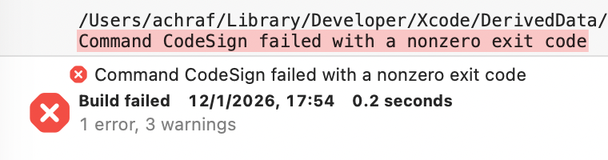
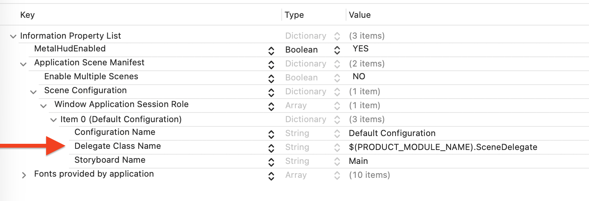
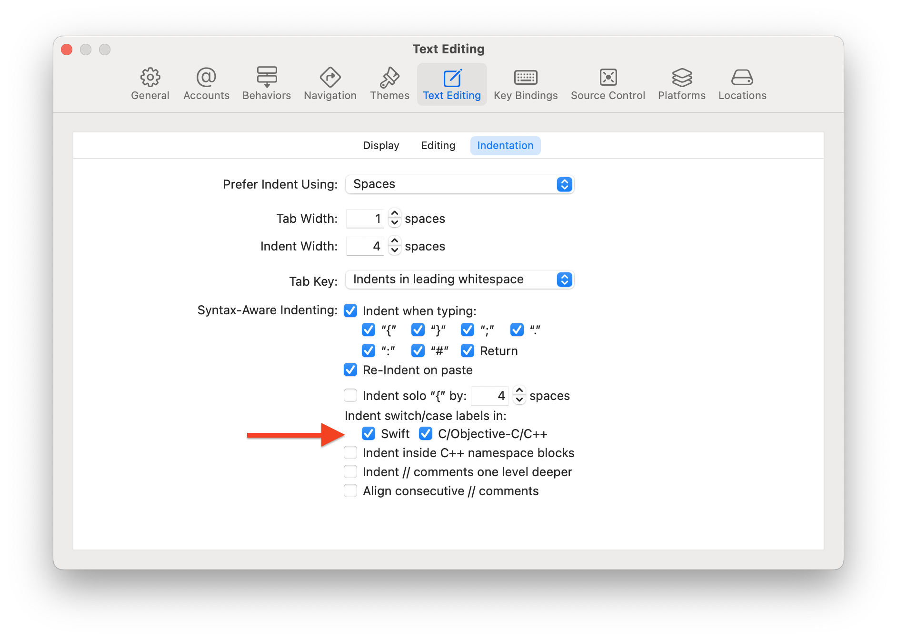

# Learning iOS Development

## CodeSign Error

*12 Jan 2026*

Sometimes I get this build error in Xcode:



```bash
Command CodeSign failed with a nonzero exit code
```

It seems this happens because the build folder is in iCloud Drive, and some meta data that iCloud adds conflicts with the code signing. Note that I didn't use to get these errors until I set up a Time Machine external drive. Maybe that is linked?

A fix is to do this in the terminal:

```bash
# Navigate to your project directory, then:
# 1. Remove meta data
xattr -cr .
# 2. Clean Xcode derived data
rm -rf ~/Library/Developer/Xcode/DerivedData
```

Xcode code should be able to build the project again.

## App Lifecycle

*19 Dec 2025*

With UIKit, AppDelegate and SceneDelegate provide extensive access to app state and device information. We can get notified when the app launches or goes to the background, set window size restrictions, or query the display's refresh rate.
In SwiftUI, we get access to some of these state changes through `ScenePhase`:

```swift
struct MyView: View {
    @Environment(\.scenePhase) private var scenePhase
    
    var body: some View {
        ZStack {
            
        }
        .onChange(of: scenePhase) { oldPhase, newPhase in
            switch newPhase {
            case .active:
                print("App is active")
            case .background:
                print("App is in the background")
            case .inactive:
				print("App is inactive")
            @unknown default:
                break
            }
        }
    }
}
```

Scene phase is a built-in environment value that can be accessed from any view. Note that the scene phase notifications do not work in Xcode Live Preview.

In order to access all the information UIKit provides, we can use `UIApplicationDelegateAdaptor` to wrap a custom AppDelegate. In the main entry point of the SwiftUI app, add this:

```swift
/**
 
 The entry point of a SwiftUI app.
 
 `UIApplicationDelegateAdaptor` bridges to UIKit's AppDelegate for lifecycle hooks
 that SwiftUI doesn't expose directly (memory warnings, device state changes, etc.).
 
 */
@main
struct MyApp: App {
    @UIApplicationDelegateAdaptor private var appDelegate: AppDelegate
    
    var body: some Scene {
        WindowGroup {
            HomeView()
        }
    }
}
```

Then create a class that inherits from `NSObject` and `UIApplicationDelegate`. The system will instantiate it, and it will act as an app delegate in a SwiftUI app:

```swift
/**
 
 AppDelegate is the entry point of a UIKit app.
 
 This class bridges UIKit's app-level events into a SwiftUI app. The name is arbitrary,
 but it must inherit from NSObject and conform to UIApplicationDelegate to function
 as the app's delegate.
 
 Note: the delegates are not called in Xcode live preview.
 
 */
class AppDelegate: NSObject, UIApplicationDelegate {
    
    /// Called when app launches, before any scenes are created
    /// Return false to abort launch, true to continue
    func application(_ application: UIApplication, didFinishLaunchingWithOptions launchOptions: [UIApplication.LaunchOptionsKey: Any]?) -> Bool {
        return true
    }

    /// New scene (window) is about to be created
    func application(_ application: UIApplication, configurationForConnecting connectingSceneSession: UISceneSession, options: UIScene.ConnectionOptions) -> UISceneConfiguration {
        
        /// Assign a scene delegate
        let config = UISceneConfiguration(name: "Default Configuration", sessionRole: connectingSceneSession.role)
        config.delegateClass = SceneDelegate.self /// UIKit will create an instance of this class for this scene
        return config
    }
    
    /// Called when system is low on memory
    /// Optimization: Clear cached data, release large objects
    func applicationDidReceiveMemoryWarning(_ application: UIApplication) {
        print("\(self) - ⚠️ Memory warning")
    }
    
    // other methods of UIApplicationDelegate
}
```

When a window/scene is created, UIKit will associate a scene delegate instance to that scene. SceneDelegate provides additional useful hooks. For example:

```swift
/**
 
 SceneDelegate manages a single scene (window) instance.
 
 Each window gets its own SceneDelegate instance. On iPhone this is typically one.
 iPad/Mac apps can have multiple windows, each with their own delegate.

*/
class SceneDelegate: NSObject, UIWindowSceneDelegate {
    
    /// iOS 26 API, replaces trait collection method
    func windowScene(_ windowScene: UIWindowScene, didUpdateEffectiveGeometry previousEffectiveGeometry: UIWindowScene.Geometry) {
        /// Call a custom function
        updateDisplayInfo(from: windowScene)
    }
    
    /// Called when UIKit creates a new scene instance
    func scene(_ scene: UIScene, willConnectTo session: UISceneSession, options connectionOptions: UIScene.ConnectionOptions) {
        guard let windowScene = scene as? UIWindowScene else { return }
        updateDisplayInfo(from: windowScene)
        
        /// Specify size restrictions for resizable windows
        windowScene.sizeRestrictions?.minimumSize.width = 768
    }
    
    /// A user custom function
    private func updateDisplayInfo(from windowScene: UIWindowScene) {
        let screen = windowScene.screen
        let refreshRate = screen.maximumFramesPerSecond
        let scale = screen.scale
        
        print("Display: \(refreshRate)Hz, @\(scale)x")
    }
    
    /// Other UIWindowSceneDelegate methods 
}
```

`UIApplicationDelegateAdaptor` provides full access to UIKit lifecycle nuances.

### Historical Context

Up until iOS 12, the app delegate was the single point of entry, and there was no scene delegate. An app could have a single window.

```swift
// iOS 12 and earlier
@UIApplicationMain
class AppDelegate: UIResponder, UIApplicationDelegate {
    
    var window: UIWindow?  // App delegate owned THE window
    
    func application(_ application: UIApplication, 
                    didFinishLaunchingWithOptions launchOptions: [UIApplication.LaunchOptionsKey: Any]?) -> Bool {
        
        // Create the ONE window for the app
        window = UIWindow(frame: UIScreen.main.bounds)
        
        // Set root view controller HERE
        window?.rootViewController = MyViewController()
        window?.makeKeyAndVisible()
        
        return true
    }
}

// No SceneDelegate existed!
```

Starting from iOS 13 and iPadOS 13, multi-window support was introduced. AppDelegate no longer owned a window property. Instead, scenes were introduced, and each scene would have its own window. A scene delegate instance manages that window.

```swift
// iOS 13+
// Multi-window support introduced for iPad and Mac Catalyst
class AppDelegate: UIResponder, UIApplicationDelegate {
    
    // No window property anymore
    
    func application(_ application: UIApplication, 
                    didFinishLaunchingWithOptions launchOptions: [UIApplication.LaunchOptionsKey: Any]?) -> Bool {
        // Don't create window here anymore
        // Just do global app setup
        return true
    }
    
    // Tell UIKit which scene delegate to use
    func application(_ application: UIApplication, 
                    configurationForConnecting connectingSceneSession: UISceneSession, 
                    options: UIScene.ConnectionOptions) -> UISceneConfiguration {
        // Option 1: Let iOS find SceneDelegate from Info.plist
        return UISceneConfiguration(name: "Default Configuration", 
                                   sessionRole: connectingSceneSession.role)
    }
}

// New in iOS 13
class SceneDelegate: UIResponder, UIWindowSceneDelegate {
    
    var window: UIWindow?  // Scene delegate owns THIS window
    
    func scene(_ scene: UIScene, 
              willConnectTo session: UISceneSession, 
              options connectionOptions: UIScene.ConnectionOptions) {
        
        guard let windowScene = scene as? UIWindowScene else { return }
        
        // Create window for THIS scene
        window = UIWindow(windowScene: windowScene)
        
        // Set root view controller HERE (per-window)
        window?.rootViewController = MyViewController()
        window?.makeKeyAndVisible()
    }
}
```

The scene delegate class was often set in the Info.plist file:



We can also set the scene delegate class programmatically:

```swift
/// Inside AppDelegate
func application(_ application: UIApplication, configurationForConnecting connectingSceneSession: UISceneSession, options: UIScene.ConnectionOptions) -> UISceneConfiguration {

    /// Assign a scene delegate
    let config = UISceneConfiguration(name: "Default Configuration", sessionRole: connectingSceneSession.role)
    // Option 2: Specify programmatically
    config.delegateClass = SceneDelegate.self /// The system will instantiate the class
    return config
}
```

### Links

- Apple Documentation, [Migrating to the SwiftUI life cycle](https://developer.apple.com/documentation/swiftui/migrating-to-the-swiftui-life-cycle).

## Subscriptions

*4 Dec 2025*

We can use NotificationCenter with Combine like so:

```swift
// Example with AVFoundation
import Combine
import AVFoundation

var subscriptions = Set<AnyCancellable>()

let player = AVPlayer(url: videoURL)
player.play()

let subscription = NotificationCenter.default.publisher(for: AVPlayerItem.didPlayToEndTimeNotification, object: player.currentItem)
    .sink { _ in
        player.seek(to: .zero)
        player.play()
    }

subscription.store(in: &subscriptions)
```

The subscription above loops a video player.

- The `object:` parameter filters notifications to only this specific player item
- `.sink { }` creates an `AnyCancellable` subscription
- `.store(in: &subscriptions)` adds it to the Set and keeps it alive
- Subscriptions cancel when removed from the Set or when the Set is deallocated
- Use `&` because `store(in:)` needs to mutate the Set

## Identifiable

*23 Oct 2025*

When I was learning SwiftUI, I'd want to use ForEach to display a list of elements, but SwiftUI seemed to require some obscure `id` argument that was frustrating. What is it about? What is this `id: \.self` I keep seeing?

```swift
enum MyItems: String, CaseIterable {
    case itemA = "Item A"
    case itemB = "Item B"
    case itemC = "Item C"
}

List {
    ForEach(MyItems.allCases, id: \.self) { item in // Notice the id argument
        Text(item.rawValue)
    }
}
```

Answer: a view in SwiftUI needs an identity. SwiftUI requires that the Text view inside the ForEach has something to identify it with, in order to track the view updates and transitions.

Good news: the id argument isn't necessary if the list supplied to ForEach conforms to Identifiable, i.e. if the list has a rule that supplies a unique ID to each of its elements. The enumeration above can be made identifiable like this:

```swift
enum MyItems: String, CaseIterable, Identifiable {
    case itemA = "Item A"
    case itemB = "Item B"
    case itemC = "Item C"
    
    var id: String { self.rawValue }
}
```

We are telling the compiler that each item of the enumeration can be identified by its raw value, which in this example is the string value attached to each case. Now in SwiftUI we can write this:

```swift
List {
    ForEach(MyItems.allCases) { item in
        Text(item.rawValue)
    }
}
```

Links:

- [WWDC21: Demystify SwiftUI](https://www.youtube.com/watch?v=XwdVz0Ef1vU&t=170s)

## break/continue

*9 September 2025*

I find the difference between `break` and `continue` in Swift confusing. Here's what seems to be the case: 

In a switch that's inside a loop:

```swift
for event in events {
    switch event {
    case .foo:
        break      // exit only the switch
                   // code after the switch still runs
                   // then the loop goes to the next item
    default:
        continue   // skip the rest of the code inside for this iteration
                   // therefore code after the switch is skipped
                   // loop goes directly to next item
    }

    // after switch code (runs only if we used `break`)
}
```

Directly in a loop:

```swift
for i in 1...5 {
    if i > 3 { break }     // exit loop entirely
    if i == 2 { continue } // skip this iteration
    print(i)
}
```

The break here will stop the loop entirely, while continue would just move to the next iteration of the loop.

## Detect When Window Moves to a Different Display

*17 April 2025*

When the window of an iOS or Catalyst app moves to a different display, how to detect the change programmatically? Inside the app `SceneDelegate.swift` file:

```swift
class SceneDelegate: UIResponder, UIWindowSceneDelegate {
    var window: UIWindow?
    
    // Logic for detection starts here
    func windowScene(
        _ windowScene: UIWindowScene,
        didUpdate previousCoordinateSpace: UICoordinateSpace,
        interfaceOrientation previousInterfaceOrientation: UIInterfaceOrientation,
        traitCollection previousTraitCollection: UITraitCollection
    ) {
        handleTraitCollectionChange(windowScene.traitCollection, previousTraitCollection)
    }
    
    private func handleTraitCollectionChange(_ newTraitCollection: UITraitCollection, _ oldTraitCollection: UITraitCollection) {
        guard let screen = window?.screen else { return }
        
        let traitsChanged = newTraitCollection != oldTraitCollection
        let refreshChanged = screen.maximumFramesPerSecond != DeviceInfo.refreshRate
        
        if traitsChanged || refreshChanged {
            // Do work
        }
    }
```

Inside `if traitsChanged || refreshChanged {}`, we can get information about the display holding the window such as `newTraitCollection.displayScale` (Retina scale) and refresh rate. This is useful for application windows that must detect monitors with different refresh rates.

## Gesture Recognizers Delegate

*27 March 2025*

Use `UIGestureRecognizerDelegate` to fine tune the gesture recognizer. For example, we can decide whether or not a specific touch event should participate in the gesture recognition by using this method of the delegate:
```swift
func gestureRecognizer(_ gestureRecognizer: UIGestureRecognizer, shouldReceive touch: UITouch) -> Bool {
    // Return false to ignore the touch
    // Return true to recognize the touch
    return true
}
```

Gesture recognizer delegates fire before the view's touch event methods. For example:

```swift
// Inside a UIView
override func touchesBegan(_ touches: Set<UITouch>, with event: UIEvent?) {
    for touch in touches {
        print("touchesBegan \(Date.now.timeIntervalSince1970)")
}

// A UIGestureRecognizerDelegate method
func gestureRecognizer(_ gestureRecognizer: UIGestureRecognizer, shouldReceive touch: UITouch) -> Bool {
    print("gestureRecognizer \(Date.now.timeIntervalSince1970)")

    return true
}
```

The print of the delegate happens before the print of the touch event. If you want to determine whether the gesture recognizer should recognize that touch or not, the logic should not depend on what the touchesBegan has determined, because that logic runs after the delegate method. The delegate method should be considered as a touch began, and any touch exclusion logic should run there.

## reserveCapacity

*15 February 2025*

[From Apple Documentation](https://developer.apple.com/documentation/swift/array/reservecapacity(_:)):

> If you are adding a known number of elements to an array, use this method to avoid multiple reallocations. This method ensures that the array has unique, mutable, contiguous storage, with space allocated for at least the requested number of elements.

This loop over a set of GKEntity:

```swift
var entities = Set<GKEntity>()

var selectedEntities: [GKEntity] = []
for entity in entities {
    if let selectionComponent = entity.component(ofType: SelectionStateComponent.self), selectionComponent.isSelected {
        selectedEntities.append(entity)
    }
}
```

Could be optimized like this:

```swift
var entities = Set<GKEntity>()

var selectedEntities = [GKEntity]()
selectedEntities.reserveCapacity(entities.count)
for entity in entities {
    if let selectionComponent = entity.component(ofType: SelectionStateComponent.self), selectionComponent.isSelected {
        selectedEntities.append(entity)
    }
}
```

But careful of pre-mature optimization. See: [Array performance: append() vs reserveCapacity()](https://www.hackingwithswift.com/articles/128/array-performance-append-vs-reservecapacity).

## Connected Screens

*28 January 2025*

You can use AirPlay to share your iPhone screen on a supported external screen, like your connected Mac.

<p align="center">

</p>
In your app, you can get the number of connected screens using this code:

```swift
let numberOfConnectedScreens = UIScreen.screens.count
```

That method returns 1 on an iPhone, and returns 2 when screen mirroring is enabled.

However, Xcode says that `UIScreen.screens` was deprecated in iOS 16. We should use a scene-based API instead of the screen based one (I find the previous screen based framework to be more intuitive and straightforward...)

```swift
let numberOfConnectedScenes = UIApplication.shared.connectedScenes.count
```

Returns 1 on an iPhone, and 2 when the screen mirroring is enabled.

## UIWindow Background Color

*25 January 2025*

<p align="center">

</p>

In some situations, like when presenting a view as a sheet, the window's background color becomes visible. The default background color, white or black, depends on the system's color scheme. Below are three approaches in a UIKit app to set a custom window background color.

### Inline

This method can be called from anywhere in your app:

```swift
func setWindowBackgroundToBlack(){
    if let windowScene = UIApplication.shared.connectedScenes.first as? UIWindowScene {
        for window in windowScene.windows {
            window.backgroundColor = .black // Set to any UIColor
        }
    }
}
```

### AppDelegate

This approach ensures the background color is applied globally, including in Xcode live previews and on both simulators and devices. However, the DispatchQueue with a delay is rather ugly. [Source](https://www.youtube.com/watch?v=6SWrpjTMvzs).

```swift
@main
class AppDelegate: UIResponder, UIApplicationDelegate {

    func application(_ application: UIApplication, didFinishLaunchingWithOptions launchOptions: [UIApplication.LaunchOptionsKey: Any]?) -> Bool {

        DispatchQueue.main.asyncAfter(deadline: .now() + 0.1) {
            if let windowScene = UIApplication.shared.connectedScenes.first as? UIWindowScene {
                for window in windowScene.windows {
                    window.backgroundColor = .black
                }
            }
        }

        return true
    }
}
```

### SceneDelegate

This method is clean but doesn't reflect changes in Xcode live previews. It only works on compiled apps running on simulators or devices.

```swift
class SceneDelegate: UIResponder, UIWindowSceneDelegate {
    var window: UIWindow?

    func scene(_ scene: UIScene, willConnectTo session: UISceneSession, options connectionOptions: UIScene.ConnectionOptions) {
        guard let windowScene = (scene as? UIWindowScene) else { return }

        let window = UIWindow(windowScene: windowScene)
        window.rootViewController = MyViewController()
        window.backgroundColor = .black
        window.makeKeyAndVisible()
        self.window = window
    }
}
```

## UIKit Z Position

*22 January 2025*

The order with which views are created matters. If a view that covers the screen is created after another view that displays a button, the full screen view will cover the button. Make sure to add views in the intended order.

You can use the z position property of a view layer to reorder its visual stacking:

```swift
myView.layer.zPosition = 10
```

However, the z position won't affect the order in which the views receive input events. If view B is created after view A and overlaps it, view B will block touch events to view A, regardless of their zPosition. Input events (like taps) are handled based on the view hierarchy and not zPosition. To handle this, you can adjust the view hierarchy using `bringSubviewToFront` or `sendSubviewToBack`:

```swift
let rootView = UIView()
let viewA = UIView()
let viewB = UIView()

rootView.addSubview(viewA)
rootView.addSubview(viewB)

// Bring view A to the front after views A and B were added
rootView.bringSubviewToFront(viewA)
```

Or disable interaction on the covering view:

```swift
viewB.isUserInteractionEnabled = false
```

## UIKit Background Blur

*22 January 2025*

In order to add a background blur effect to a view, you create a special type of view and add it as a subview to the view you want to blur.

```swift
func testBlurEffect() {
    // Create a test view
    let testView = UIView()
    testView.frame = CGRect(x: 50, y: 100, width: 200, height: 200)
    testView.backgroundColor = UIColor.white.withAlphaComponent(0.1)
    testView.layer.cornerRadius = 20
    testView.layer.cornerCurve = .continuous
    testView.clipsToBounds = true // Ensure blur respects rounded corners
    testView.alpha = 1 // Make sure the alpha is 1 (default value)
    view.addSubview(testView)

    // Add a blur effect to the test view
    let blurEffect = UIBlurEffect(style: .light) // You can try other styles
    let blurView = UIVisualEffectView(effect: blurEffect)
    blurView.frame = testView.bounds
    blurView.autoresizingMask = [.flexibleWidth, .flexibleHeight] // Ensure it resizes with testView
    testView.addSubview(blurView)
}

override func viewDidLoad() {
    super.viewDidLoad()
    testBlurEffect()
}
```

Adding `clipsToBounds = true` to the main view will constraint the blur within the visible bounds of the view, for example if the view has rounded corners.

Note that the alpha property of `myView` must be 1. If you set the alpha to a value less than 1, the blur view won't render as expected.

## info.plist

*19 January 2024*

If you are organizing your Xcode project files, do not move your info.plist file from the root of your project folder. The build won't succeed if Xcode doesn't find the info file where it expects it to.


## Zip

*11 January 2025*

Suppose you have two arrays, and you want a loop that iterates through the two arrays at the same time, taking one value from each array at each step, as if the two arrays were data models that store different types, like this:

```swift
let colors: [SKColor] = [.white, .systemYellow, .systemTeal, .systemPink]
let scales: [CGFloat] = [1, 2, 0.5, 1.25]
```

You want to create something that takes both a color and a scale from the arrays. You can write this:
```swift
for (color, scale) in zip(colors, scales) {
    // do something with each `color`
    // do something with each `scale`
}
```

`zip`! Nice! And if the two arrays have different lengths, `zip` only combines elements up to the length of the shorter one.

## Satisfying

*9 January 2025*

It was satisfying to discover the Swift array property `allSatisfy`. We can use it to check if all items of an array satisfy a given condition. For example:

```swift
let draggableNodes = [Draggable]()

// Each instance of Draggable has a boolean property called `dragWithPhysics`
// The line below check if all members have the same value for that property
let draggablesHaveDragWithPhysics = draggableNodes.allSatisfy { $0.dragWithPhysics }
```

The method works on any array and is perfect for checking uniformity among elements. For instance, we can check that all numbers in an array are positive with `numbers.allSatisfy { $0 >= 0 }`. In Swift, `$0` represent "each element" in the collection being processed.

`allSatisfy` returns `true` for an empty array because there’s no element to contradict the condition.

## UIKit Dynamics

*22 December 2024, updated 11 January 2025*

UIKit includes a physics engine. It has physics fields and collisions, and it is reminiscent of what SpriteKit offers.

> One notable and common use of a dynamic item behavior is to confer a velocity to a dynamic item to match the ending velocity of a user gesture.

[UIDynamicItemBehavior](https://developer.apple.com/documentation/uikit/uidynamicitembehavior).

Apple has a project sample called [StickyCorners](https://developer.apple.com/library/archive/samplecode/StickyCorners/Introduction/Intro.html#//apple_ref/doc/uid/TP40016189-Intro-DontLinkElementID_2). It implements a square that we can throw around with touch gestures, and the square would stick to the nearest screen corner. I think it is this sort of early experiments that grew into many current iOS behaviors such as the picture-in-picture overlay. The sticky corners demo dates from 2016. When you open it with Xcode 16, Xcode will say that it does not support that Swift version. But there is only one notable change to make, which is to add an `objc` prefix before some gesture functions, and the project will run perfectly. You can even live preview it on the canvas, by putting the view controller inside a `#Preview` macro.

https://github.com/user-attachments/assets/3020a8e5-4b4c-4731-9209-3568c802d8ba

## Gesture Recognizers Response Chain

*18 December 2024*

Gesture recognizers are setup on a UIView. I have a [SpriteKit custom camera](https://github.com/AchrafKassioui/SpriteKit-Inertial-Camera) class that uses gesture recognizers to handle pan, pinch, and rotation. At first, I setup the gesture recognizers on the SKView that presents the scene in which the camera is instantiated. However, I noticed that if I have views in the UIViewController that presents the SpriteKit scene through a child SKView, the UIViews on top of the SKView intercept the gestures, and they are no longer fed to the SpriteKit camera.

I knew from the start that I had to clarify my gesture recognition setup: does each instance of the camera create its own gesture recognizers? Do they multiply? Or is there one global gesture recognition logic that dispatches the events to as many objects as there are objects handling gestures?

While exploring UIKit views, I found out that if I double setup the camera gesture recognizers on both the SKView and an UIView on top of the SKView, the pan translation would compound on the camera. The gesture translation was being called twice. I needed clarity about which view should handle the gesture recognition, and later in the code I'd choose which object on which view should respond to the gesture recognition information.

Before in the camera initialization:

```swift
class InertialCamera: SKCameraNode, UIGestureRecognizerDelegate {
    /// The scene where the camera is instantiated
    weak var parentScene: SKScene?

    /// The SKView presenting the scene.
    weak var parentView: SKView?

    init(scene: SKScene, parentView: SKView) {
        super.init()
        self.parentScene = scene
        self.parentView = parentView
        self.setupGestureRecognizers(view: parentView)
    }
    
    func setupGestureRecognizers(view: SKView) {
        let panRecognizer = UIPanGestureRecognizer(target: self, action: #selector(panCamera(gesture:)))
        panRecognizer.delegate = self
        /// ...
        view.addGestureRecognizer(panRecognizer)
    }  
}
```

After:

```swift
class InertialCamera: SKCameraNode, UIGestureRecognizerDelegate {
    /// The scene where the camera is instantiated
    weak var parentScene: SKScene?

    /// The view to which the gesture recognizers are attached.
    /// It could be the SKView rendering the SKScene in which the camera is instantiated.
    /// Or a UIView that is the superview of the view presenting the scene.
    weak var gesturesView: UIView?

    init(scene: SKScene, gesturesView: UIView) {
        super.init()
        self.parentScene = scene
    }
    
    /// This has now to be called manually from the UIView hierarchy, outside the camera class
    func setupGestureRecognizers(gesturesView: UIView) {
        let panRecognizer = UIPanGestureRecognizer(target: self, action: #selector(panCamera(gesture:)))
        /// ...
        gesturesView.addGestureRecognizer(panRecognizer)
    }
}
```

Then in the UIKit view controller:

```swift
class MyViewController: UIViewController {
    let scene = MyScene()
    
    /// ...

	override func viewDidLoad() {
        super.viewDidLoad()

        if let camera = scene.camera as? InertialCamera {
            camera.gesturesView = view
            camera.setupGestureRecognizers(gesturesView: view)
        }
    }
}
```

This is a temporary setup. Creating the camera this way requires to instantiate it in the SKScene AND setup its gesture recognizers in the UIView that owns the SKView. But this was a cool find that helped me understand how gesture recognizers work.

The idea forward is to setup one gesture recognizer that handles all gestures, and then each components that needs gestures, whether in SpriteKit or in UIKit, would listen to the events sent by that one recognizer from the superview. State management would do the rest.

## Xcode Wishlist

*18 December 2024, updated 17 January 2025*

- A shortcut to restore the caret position. Navigating text in macOS doesn't feel great to me. Sometimes I hit the "Home" or "End" keys, and I can't get easily back to my position in the file.
- I'd like to mark a file on the navigator pane on the left with a color or a visual indicator. That way, I can find it faster.
- I'd like to put a stickie or a text block next to the code. This text block can be dragged, pinned, or resized. I could put formatted code inside that block as well as regular text.

## Center an Image in Storyboard

*15 December 2024*

If you have a launch image (aka splash screen) you want to center on screen, regardless of screen size, here are the steps to do that with Xcode Interface Builder. Assuming the image has a fixed width and height:


1. Select the LaunchScreen.storyboard file. Interface Builder is the set of tools that appear when you select a .storyboard file.
2. Select the View in the View Controller.
3. Click the + button, search for Image View.
4. Drag the Image View on top of the View Controller’s view.


5. Click the icon "Add New Constraints".
6. Check the width and height, and fill in the values (the size of your image).


7. Click the "Align" icon.
8. Check "Horizontally in Container" and "Vertically in Container".

This ensures your image is centered and does not resize larger than its natural dimensions.

## App Entry Point

*15 December 2024*

To define which view controller is the entry point of your UIKit app, select the SceneDelegate.swift file, and find this function:

```swift
func scene(_ scene: UIScene, willConnectTo session: UISceneSession, options connectionOptions: UIScene.ConnectionOptions) {

}
```

Then put this code inside it:

```swift
func scene(_ scene: UIScene, willConnectTo session: UISceneSession, options connectionOptions: UIScene.ConnectionOptions) {
    guard let windowScene = (scene as? UIWindowScene) else { return }

    /// Create the window with the given scene
    window = UIWindow(windowScene: windowScene)
    /// Set the custom view controller as the root
    window?.rootViewController = MyViewController() /// The name of your view controller
    /// Make the window visible
    window?.makeKeyAndVisible()
}
```

## First Mistakes with UIKit

*Updated 25 January 2025*

Missteps and incomprehensions I had while learning UIKit.

### Initializing a UIViewController

- Mistake: using `super.init()`
- Solution: use this weird super init instead `super.init(nibName: nil, bundle: nil)`

```swift
class MyViewController: UIViewController {
    let customProperty: CGFloat

    // Custom initializer with a property
    init(customProperty: CGFloat) {
        self.customProperty = customProperty
        super.init(nibName: nil, bundle: nil) // ???
    }

    // Required
    required init?(coder: NSCoder) {
        fatalError("init(coder:) has not been implemented")
    }
}
```

### Enable Auto Layout on a View

- Mistake: adding auto layout constraints to a view *before* adding the view to the view hierarchy.
- Solution: first add the view to the hierarchy, and then declare the Auto Layout constraints for that view.

## Background Tasks

*27 November 2024*

Interesting resources:

- Apple Developer Forums, [UIApplication Background Task Notes](https://developer.apple.com/forums/thread/85066), *accessed 27 November 2024*
- Apple Developer Forums, [iOS Background Execution Limits](https://forums.developer.apple.com/forums/thread/685525), *accessed 27 November 2024*

## Hide Status Bar

*20 November 2024*

In order to hide the status bar in an iOS app, add the entry "View controller-based status bar appearance" in the info tab of your project configuration.


In order to hide the homebar, add this modifier to your SwiftUI view:

```swift
struct MyView: View {
    var body: some View {
        ZStack {
            // ...
        }
        .persistentSystemOverlays(.hidden) // Add this modifier
    }
}
```

With UIKit, override these two properties of UIViewController and return true.

```swift
class MyViewController: UIViewController {
    override var prefersStatusBarHidden: Bool {
        return true
    }

    override var prefersHomeIndicatorAutoHidden: Bool {
        return true
    }
}
```

Overriding a property means that the class `UIViewController` has these two properties associated with a default value. When you override them in a subclass inheriting from `UIViewController`, you can assign different values to them.

## Interesting Methods

*23 October 2024, updated 23 Dec 2025*

```swift
// Get display gamut from inside a UIView
let gamut: UIDisplayGamut
if let screen = view.window?.windowScene?.screen {
    gamut = screen.traitCollection.displayGamut
    print(gamut)
}

// Delay the execution of something, Mac and iOS
DispatchQueue.main.asyncAfter(deadline: .now() + 0.1) {
    // Run something after 0.1 second
}

// Animate something over a duration in UIKit
UIView.animate(withDuration: 0.3) {
	// ..
}

// Get information about the display in UIKit
UIScreen.main.brightness
UIScreen.main.nativeBounds
UIScreen.main.scale
// Xcode says that `main` will be deprecated, use this instead:
view.window?.screen.scale

// Create thumbnails from images in UIKit
let myImage: UIImage
myImage.preparingThumbnail(of: CGSize(width: 60, height: 60))

// Haptic feedback in UIKit
let hapticFeedback = UIImpactFeedbackGenerator()
hapticFeedback.prepare() // Run inside a closure to get the taptic engine ready
hapticFeedback.impactOccurred(intensity: 0.5)
```

## Functions as Argument

*22 October 2024*

How to pass a function as an argument in Swift?

```swift
func myFunction(action: () -> Void) {
    action()
}
```

The type `() -> Void` means the argument is a closure (or function) that takes no parameters and returns nothing `Void`. To call that function, we can write:

```swift
myFunction(action: myOtherFunction)
```

Or use the trailing closure syntax:

```swift
myFunction {
    // any code to execute
}
```

## Async Patterns

*18 October 2024*

```swift
Task {
    // call an async function here
    let someBackgroundValue = await myBackgroundMethod()
    
    await MainActor.run {
        // when the async function returns some value,
        // use it here in the main thread 
    }
}
```

The `await` above expects an `async` function with this signature:

```swift
func myBackgroundMethod() async -> ReturnType {
    //...
}
```

To use something from the main thread inside the task closure, we can write this:

```swift
Task {
    let neededValueFromMainThread = await MainActor.run {
        // the main thread method here
    }
}
```

## Swift 6

*27 October 2024*

I didn't find a way to use GameplayKit and SpriteKit with Swift 6. The Swift 6 compiler keeps shouting about nonisolation and other errors. GameplayKit doesn't seem to be Swift 6 ready. Or rather, Swift 6 doesn't seem to be ready nor friendly. Switching back to Swift 5.

See the issue with GameplayKit and Swift 6 on the [Apple Forums](https://forums.developer.apple.com/forums/thread/767042) and [StackOverflow](https://stackoverflow.com/questions/79128004/gameplaykit-usage-with-swift-6-call-to-main-actor-isolated-instance-method-run).

*16 October 2024*

I switched my Xcode project from Swift 5 to Swift 6 and got 64 errors and counting. Most errors have to do with `@MainActor`, `non-'Sendable' type`, and thread safety. I'll investigate one particular example.

I have a top-level Core Graphics function designed to generate a SpriteKit texture. I often use Core Graphics functions to generate textures like grids and drop shadows. A generator would look something like this:

```swift
// Grid Generator
func generateGridTexture(cellSize: CGFloat, rows: Int, cols: Int, linesColor: SKColor) -> SKTexture {
    // Process the arguments...
    
    // Note this line
    let scale = UIScreen.main.scale
    
    // ...
    let renderer = UIGraphicsImageRenderer(size: size)
    let image = renderer.image { ctx in
        let context = ctx.cgContext       
        // Drawing logic...
    }
    // Return the image as a SpriteKit texture
    return SKTexture(image: image)
}
```

After the switch to Swift 6, the compiler generated the error: "Main actor-isolated class property 'main' can not be referenced from a nonisolated context" on the line `let scale = UIScreen.main.scale`. I'm accessing a method that runs on the main thread inside a function that is outside an existing main thread context. The straightforward fix was to prefix the whole function with `@MainActor`:

```swift
@MainActor func generateGridTexture(cellSize: CGFloat, rows: Int, cols: Int, linesColor: SKColor) -> SKTexture {
    // ...
}
```

My understanding is that any code running on the main thread is considered part of the main actor by default or should be marked as such. UI related code is main thread. Many SpriteKit methods are main thread. Since my generator uses a UIKit method `UIScreen.main.scale` that runs on the main thread, and because my function is top-level and not nested in an existing main actor context, the compiler requires a clarification.

In my case, the purpose of the generator is to programmatically generate an image. The generation itself does not need to execute in the main thread. Only the integration of the texture into SpriteKit does. So I rewrote the generator using `async` and pure Core Graphics:

```swift
// Note the async
func generateGridTexture(cellSize: CGFloat, rows: Int, cols: Int, linesColor: CGColor) async -> CGImage {
    // Process the arguments here...
    
    // Core Graphics settings
    let colorSpace = CGColorSpaceCreateDeviceRGB()
    
    // Create a bitmap context
    guard let context = CGContext(
        data: nil,
        width: Int(size.width),
        height: Int(size.height),
        bitsPerComponent: 8,
        bytesPerRow: 0,
        space: colorSpace,
        bitmapInfo: CGImageAlphaInfo.premultipliedLast.rawValue
    ) else {
        print("generateGridTexture: failed to create CGContext.")
        return createEmptyImage() // Fallback function
    }
    
    context.clear(CGRect(origin: .zero, size: size))   
    context.strokePath()
    // Additional Core Graphics logic...
    
    // Return the generated image
    if let generatedImage = context.makeImage() {
        return generatedImage
    } else {
        print("generateGridTexture: failed to create CGImage.")
        return createEmptyImage()
    }
}
```

Then, I'd call the generator like this inside SpriteKit, using `Task` and `await`:

```swift
Task {
    // Generate the grid image in the background
    let gridImage = await generateGridTexture(cellSize: 60, rows: 10, cols: 10, linesColor: CGColor(red: 0, green: 0, blue: 0, alpha: 0.5))

    // Switch back to the main actor to use some main actor methods
    // Here we use addChild, a SKNode method, which is a main actor class.
    await MainActor.run {
        let uiImage = UIImage(cgImage: gridImage)
        let backgroundTexture = SKTexture(image: uiImage)
        let backgroundSprite = SKSpriteNode(texture: backgroundTexture)
        addChild(backgroundSprite)
    }
}
```

The generator now works asynchronously, requesting the main thread only when the generated image is actually ready. Nice! Sooner or later, I was planning to send to the background the tasks that don't need to block the UI. `async`, `Task`, and `await` provide me with a pattern, which will be useful for file I/O and other background jobs.

However, the rewrite comes with more verbose code, and it forces to think about different frameworks more carefully. For example, I thought I was using pure Core Graphics in my previous generator. Turns out, in addition to SpriteKit `SKColor` and `SKTexture`, I was using a UIKit API on top of Core Graphics called `UIGraphicsImageRenderer`. While rewriting the generator, I tried to minimize the dependencies, and only import CoreGraphics, since `UIGraphicsImageRenderer` requires to import UIKit or SpriteKit, and it doesn't work natively for macOS (though it is compatible with Mac Catalyst).

Compared to my original implementation with `UIGraphicsImageRenderer`, the pure Core Graphics version produces less sharp images and less saturated colors. `UIGraphicsImageRenderer` automatically generate P3 colors, and its anti-aliasing looks superior. I'm sure pure Core Graphics could produce similar results, for both iOS and macOS. But it will require further exploration.

This is typical whenever I explore a new aspect of a programming language. It can be useful and even fascinating, but it often sends me on side quests that distract from the main goal.

## The Magic of SwiftUI

*5 June 2024*

SwiftUI is a collection of opinionated magical invocations that you need to learn and put in the right order to get work done. SwiftUI isn't C, isn't Swift, isn't imperative. SwiftUI is its own thing.

Here is a code example that gets you the size of a view once it is rendered:

```swift 
GeometryReader { geoProxy in
    SpriteView(scene: myScene)
    .ignoresSafeArea()
    .onChange(of: geoProxy.size) {
        print("New size is \(geoProxy.size)")
    }
}
```

You have to know that you need to use something like `onChange` or `onAppear` in order to execute code inside them, and therefore access the information you seek. You can not just write commands on any line. The following code isn't valid SwiftUI:

```swift
GeometryReader { geoProxy in
    print(geoProxy) // you can not use print like this
    SpriteView(scene: myScene)
    .ignoresSafeArea()
}
```

However, you can write this:

```swift
GeometryReader { geoProxy in
    let proxy = geoProxy // assigning the geometry proxy to a constant is ok
    SpriteView(scene: myScene)
    .ignoresSafeArea()
    .onChange(of: proxy.size) {
        print("New size is \(proxy.size)") // access the constant here
    }
}
```

You can not write this:

```swift
GeometryReader { geoProxy in
    SpriteView(scene: myScene)
    .ignoresSafeArea()
    .onChange(of: geoProxy) { // you can not listen to changes of the geometry proxy itself
        print(geoProxy) // not valid
    }
}
```

You have to use one of the properties of the geometry proxy, such as `size` or `safeAreaInsets`.

## Delegation Pattern

*30 May 2024*

In the Apple programming world, the delegation pattern is a common pattern that allows one object to tell another object to do something. For example:

```swift
/// A framework to use for this example
import SpriteKit

/// Define a protocol
/// Any object that conforms to this protocol must implement the methods defined here
protocol ButtonDelegate: AnyObject {
    func buttonTouched(touch: UITouch)
}

/// Object A, the delegator
class MyButton: SKSpriteNode {
    weak var delegate: ButtonDelegate?

    override func touchesBegan(_ touches: Set<UITouch>, with event: UIEvent?) {
        for touch in touches {
            delegate?.buttonTouched(touch: touch)
        }
    }
}

/// Object B, the delegate
class MyScene: SKScene, ButtonDelegate {
    override func didMove(to view: SKView) {
        let myButton = MyButton(color: .red, size: CGSize(width: 150, height: 150))
        myButton.delegate = self
        addChild(myButton)
    }

    /// Conform to the protocol by implementing its methods
    func buttonTouched(touch: UITouch) {
        /// Whenever myButton is touched, this function is called
        print("Button was touched!")
    }
}
```

The delegation pattern is one way amongst many to implement messaging between objects. Other ways include using the Notification Center. [This post](https://stackoverflow.com/a/28309749/420176) compares the performance of delegation vs notification center.

## Gestures

*15 April 2024*

A basic setup to add a tap recognizer to a view (a SpriteKit view in this case)

```swift
override func didMove(to view: SKView) {
	setupGestureRecognizers(in: view)
}

func setupGestureRecognizers(in view: SKView) {
    let tapGesture = UITapGestureRecognizer(target: self, action: #selector(handleTap(gesture:)))
    tapGesture.numberOfTapsRequired = 2 // This is a double tap
    tapGesture.numberOfTouchesRequired = 1
    view.addGestureRecognizer(tapGesture)
}

@objc func handleTap(gesture: UIGestureRecognizer) {
    // do something on double tap
}
```

## Xcode Comments

*9 April 2024, updated 16 August 2025*

Xcode provides various ways to style and organize code comments:

```swift
// Regular comment

/// Comment written in regular characters, not monospace characters.

/// `inlineCode`

// MARK: - A title that creates a line separator

// MARK: A title that is visible in the minimap

// TODO: A flag for a todo item

// FIXME: A flag for an issue to fix

/**
 
 # Documentation Block with a Title
 
 Function signature documentation:
 - Parameter name: description of the parameter.
 
 */
 
/// Function signature documentation:
/// - Parameter parameterName1: a description of the first parameter.
/// - Parameter parameterName2: a description of the second parameter.
```
<p align="center">

</p>


## Get the Physical Corner Radius of a Device

*8 April 2024*

Copy this extension somewhere, or create a file for it in your Xcode project:

```swift
//  Created by Kyle Bashour on 10/24/20.

import UIKit

extension UIScreen {
    private static let cornerRadiusKey: String = {
        let components = ["Radius", "Corner", "display", "_"]
        return components.reversed().joined()
    }()
    
    /// The corner radius of the display. Uses a private property of `UIScreen`,
    /// and may report 0 if the API changes.
    public var displayCornerRadius: CGFloat {
        guard let cornerRadius = self.value(forKey: Self.cornerRadiusKey) as? CGFloat else {
            assertionFailure("Failed to detect screen corner radius")
            return 0
        }
        
        return cornerRadius
    }
}
```

Then, in your code, you can access it if you have access to `UIScreen.main`. For example, inside a SpriteKit scene class:

```swift
override func didMove(to view: SKView) {
    let displayCornerRadius = UIScreen.main.displayCornerRadius
    // do something with the corner radius value
}
```

## Core Animation

*8 April 2024*

Core Animation backs many of animations on iOS. You can access the Core Animation object that holds a view with `view.layer`. For example, we can add a border to the view by defining it on its CALayer parent:

```swift
view.layer.borderWidth = 5
view.layer.borderColor = .red
```

Core Animation was developed by a single Apple engineer, John Harper. Source: [here](https://stackoverflow.com/questions/38297961/when-is-it-appropriate-to-use-core-animation-over-uiview-animation-in-common-cas#comment93215312_38965402) and [here](https://x.com/andy_matuschak/status/1587248459299463169).

## Methods on Numbers

*22 March 2024, updated 17 January 2025*

```swift
// Calculate the smallest equal or greater integer
let width: CGFloat = 390
let integer = Int(ceil(width / 150)) // 3

// Round a number to 1 decimal place
let myFloat: CGFloat = 1.23456
let myValue = round(myFloat * 10) / 10
```

## Generate a Grid Image

*21 March 2024*

This Core Graphics program creates a grid and saves it as a PNG image. You can copy paste the code into a new file in Xcode, run the SwiftUI live preview, press the one button in the view, and get the image file path from the Xcode console.

```swift
import SwiftUI

/// SwiftUI view
struct GenerateGridImageUI: View {
    var body: some View {
        Button(action: {
            generatePNG()
        }, label: {
            Text("Generate Grid")
                .font(.title2)
        })
        .buttonStyle(.borderedProminent)
        Text("The file path of the generated image will be printed in the console.")
            .padding(20)
            .multilineTextAlignment(.center)
    }
}

/// this will run the live preview in Xcode
#Preview {
    GenerateGridImageUI()
}

/**

 Configure your grid here:
 - Parameter cellSize: the width, in points, of a square in the grid
 - Parameter rows: the number of horizontal squares in the grid
 - Parameter columns: the number of vertical squares in the grid
 
 The actual size of the image in pixels depends on the device you are running on.
 If the device runs at 3x scalling like most recent iPhones, then a 1 point = 3 pixels
 If the device is a retina Mac, then 1 point = 2 pixels
 
 */
func generatePNG() {
    if let pngData = generateGrid(cellSize: 50, rows: 10, cols: 10) {
        let paths = FileManager.default.urls(for: .documentDirectory, in: .userDomainMask)
        let filePath = paths[0].appendingPathComponent("grid.png")
        
        do {
            try pngData.write(to: filePath)
            print("Saved grid image at: \(filePath)")
        } catch {
            print("Failed to save image: \(error)")
        }
    }
}

/// The Core Graphics function
func generateGrid(cellSize: CGFloat, rows: Int, cols: Int) -> Data? {
    let size = CGSize(width: CGFloat(cols) * cellSize + 1, height: CGFloat(rows) * cellSize + 1)
    
    let renderer = UIGraphicsImageRenderer(size: size)
    let image = renderer.image { ctx in
        let bezierPath = UIBezierPath()
        let offset: CGFloat = 0.5
        for i in 0...cols {
            let x = CGFloat(i) * cellSize + offset
            bezierPath.move(to: CGPoint(x: x, y: 0))
            bezierPath.addLine(to: CGPoint(x: x, y: size.height))
        }
        for i in 0...rows {
            let y = CGFloat(i) * cellSize + offset
            bezierPath.move(to: CGPoint(x: 0, y: y))
            bezierPath.addLine(to: CGPoint(x: size.width, y: y))
        }
        
        /// the color of the strokes
        UIColor(white: 0, alpha: 1).setStroke()
        
        /// the thickness of the strokes
        bezierPath.lineWidth = 1
        
        bezierPath.stroke()
    }
    
    return image.pngData()
}
```


Many times I needed to generate such a pattern in Figma or Pixelmator. Generating large repetitive visual patterns is not trivial to do in 2D drawing software. 3D programs like Cinema 4D do a better job at generating visual patterns, but the setup is heavier and exporting is cumbersome.

## Else Continue

*20 March 2024*

Consider this code:

```swift
override func touchesMoved(_ touches: Set<UITouch>, with event: UIEvent?) {
    for touch in touches {
        guard let label = touchLabels[touch] else { continue } // the important bit
        let touchLocation = touch.location(in: self)
        label.position = CGPoint(x: touchLocation.x, y: touchLocation.y + 60)
        label.text = pointToString(touchLocation)
    }
}
```

I find the "continue" keyword in the line using `guard` very confusing. In fact, `continue` doesn't mean that the code continues executing. It means that the immediately following code will NOT be executed, and the next iteration will be evaluated instead. In this case, the next iteration is the next `touch` in `touches`.

`continue` should be "skip" or "next". It skips any code below the guard statement and within the scope. Note that the compiler will allow `continue` only inside a loop.

## Required Reason API

*20 March 2024*

In 2023, Apple started requiring reasons for using some APIs in apps published on the AppStore. Here are some of these APIs:

### `systemUptime`

In UIKit, UITouch objects have a [timeStamp](https://developer.apple.com/documentation/uikit/uitouch/1618144-timestamp) property. The timeStamp property is the time in seconds, since system startup, when the touch originated or was last changed. It inherits from the [systemUptime](https://developer.apple.com/documentation/foundation/processinfo/1414553-systemuptime) property, which requires a declaration and usage justification to Apple.

Discussion: SpriteKit's game loop—a core function of any game engine—provides a currentTime value which is the system time, expressed in terms of seconds since system startup. Do we have to declare usage of a game loop in an app? How does that work?

[This Apple documentation page](https://developer.apple.com/documentation/bundleresources/privacy_manifest_files/describing_use_of_required_reason_api) "explains" how required reason API work. APIs that require a reason to use have preset justifications that the developer must declare they follow. For example, in the case of touch event timestamps, one of the preset justification is:

> 35F9.1
> Declare this reason to access the system boot time in order to measure the amount of time that has elapsed between events that occurred within the app or to perform calculations to enable timers.
> Information accessed for this reason, or any derived information, may not be sent off-device. There is an exception for information about the amount of time that has elapsed between events that occurred within the app, which may be sent off-device.

## Code Notation

*17 March 2024*

Throughout Apple documentation and references, you'll see specific ways of mentioning code that doesn't quite look like the code you actually write. Things like `init(ciFilter:duration:)`. Here's some examples to start you off:

### `init(ciFilter:duration:)`

Actual code:

```swift
let someObject = SomeObject(ciFilter: myFilter, duration: 1.0)
```

`SomeObject` is the class that has that method. `someObject` is an instance of that class. `myFilter` and `1.0` are user defined values that are of the type expected by that method's parameters.

The doc signature `(x:y:)` means that x and y are parameter names, and that the parameter names must be included when calling that API. If the doc signature was `(_:_:)`, then the API would still expect two parameters, but without explicitly naming them. See "The underscore _" note about that.

### `enumerateBodies(at:using:)`

Actual code: 

```swift
physicsWorld.enumerateBodies(at: touchLocation) { body, stop in
	// code for each body
	// optionally, set stop to true to stop enumeration
}
```

## AudioToolBox

*5 March 2024*

If you need to implement some quick sound effects in your app, you can use this old framework. AudioToolBox is fast and requires no advanced setup. It includes the system sounds you are used to on iOS, like the swoosh (Mail) sound or the keyboards clicks.

```swift
// import the framework
import AudioToolbox

// anywhere in your code, call this method by passing a decimal
// see the system sounds list below
AudioServicesPlaySystemSound(1306)
```

Credits to WaliD on [StackOverflow](https://stackoverflow.com/a/65776719/420176) for mentioning this framework. For a list of available sounds and their code, check [iOSSystemSoundsLibrary](https://github.com/TUNER88/iOSSystemSoundsLibrary). As a note for myself, I like these clicking sounds: 1057, 1103, 1104, 1105, 1107, 1257, 1306.

## Optionals

*1 March 2024*

Optionals are annoying when you start writing Swift code. The compiler will often be shouting about "unwrapping optionals". One way of understanding optionals goes like this:

Swift has opinions. It claims that computer programs crash because they expect data that is not there. Programs expect data that is not there because programmers told them to. But in practice, the data may or may not have been fetched or created yet. Therefore Swift thinks that programmers need discipline on how they declare data holders.

In your code, when you declare a variable, Swift expects that you either give it an initial value, or declare it as an optional. An optional is nil by default—until specified otherwise. When you want to use an optional variable in your code later on, the explicit declaration of that variable as an optional means that you need to write special code to handle the optional. That's what *safe unwrapping* is.

```swift
class MyClass {
    // variable with initial value. No issue
    var number = 1
    // variable without an intial value
    // the type must be declared, plus the optional `?` nature
    var aNumber: Int?
    
    // later on
    
    // safe unwrapping
    if let aNumber = aNumber {
        // safely unwrapped `aNumber`
    }
}
```

You *could* declare an uninitialized variable as non optional using a `!` like this:

```swift
class MyClass {
    var someNumber: Int!
}
```

That would mean that you are sure that by the time you'll use `someNumber` in your code, it *will* have a value that is not `nil`. Use carefully.

Throughout your code, you'll notice that methods or properties are sometimes followed by a `?`. That means that the value they refer to might not exist at that point. For example, an optional chain like `myObject?.doSomething()` will attempt to execute the method only if myObject is non-nil. If myObject is nil, the operation is safely skipped, avoiding crashes.

## init

*28 February 2024*

You'll see the `init` keyword very often in Swift. What is it?

`Init` stands for initialization. It's how you create an instance of a class. For example:

```swift 
class MyClass {
    var name: String
    
    init(name: String) {
        self.name = name
    }
}
```

That boilerplate code allows you to create an instance of `MyClass` anywhere by writing:

```swift
var myInstance = MyClass(name: "Achraf")
```

So `init` is the method that you implicitly call whenever you write `MyClass()`, with or without parameters inside `()` depending on what the class expects. You define whether or not the class expects parameters with the `init` function signature inside the class definition.

You can have multiple initializers for the same class, each with a different signature. This feature allows you to create instances of a class in different ways, depending on the context or the specific needs of your code. For example:

```swift
class MyClass {
    // Note the optional type of the properties
    var name: String?
    var location: String?
    // This adjustment is necessary because each initializer sets only one of these properties
    // In Swift, all properties of a class must be initialized during instantiation,
    // either with a non-nil value or as nil for optionals

    init(name: String) {
        self.name = name
    }

    init(location: String) {
        self.location = location
    }
}
```

That way, you can create an instance by writing `var myInstance = MyClass(name: "Achraf")`, or `var myInstance = MyClass(location: "Tangier")`. In practice, this is how you get APIs that create objects in different ways. For example in SpriteKit you could create a sprite node by calling `mySpriteNode = SKSpriteNode(texture: myTexture)` or `mySpriteNode = SKSpriteNode(imageNamed: myImageName)`. Each of these correspond to different initializers inside the SKSpriteNode class.

## Enum

*27 February 2024*

Suppose you have a finite list of states for an object. You want to define a specific behavior for each state. How would you implement that?

One way is to use `enum`. An enumeration is a type safe way to tell the compiler that this object has these different cases. Then, when you want to write code for each case, you'll switch through the cases, and the compiler will make sure that you've captured all of them, or at least provided a default fallback behavior. Example:

```swift
enum Direction {
    case left
    case up
    case right
    case down
}

func move(direction: Direction) {
    switch direction {
    case .left:
        // do something
    case .up:
        // do something
    case .right:
        // do something
    case .down:
        // do something
    }
}
```

Whenever you'll write a piece of code that expects data of type `Direction`, the auto-complete will show you all the applicable options from the `Direction` enum. If you start writing `move(.)`, auto-complete will show you `.left, .up, .right, .down` right after you type `.` inside the function's arguments.

Note that in Swift, the `case` statements are aligned with the `switch` keyword, instead of being indented further. I find it counter-intuitive, but that is the convention in Swift. You can change that behavior in Xcode Settings, to suit your preference:



## Local Web Server

*26 February 2024*

If you need to start a web server on your Mac, so you can open HTML pages and test some links and code, you don’t need to download or install anything. You can:

- Command + right-click the folder where you want to start a web server
- Paste `python3 -m http.server 9000` in the command line, where `9000` is your desired port.
- Open your browser and go to address `localhost:9000`

## Static

*Update 27 October 2024*

If the property of a `class` or `struct` is marked as `static`, we can change its value at runtime, and all existing instances of the class or struct will immediately update to the new value.

```swift
class MyClass {
	var property = 1 // Instance property
    static var sharedProperty = 10 // Static (class) property
}

let myInstance = MyClass()
print(myInstance.property) // 1 (unique to this instance)
print(MyClass.sharedProperty) // 10 (shared across the type)

MyClass.sharedProperty = 100
print(MyClass.sharedProperty) // 100 (reflects updated value)
```

Note that we can not access a static property from an instance. `myInstance.sharedProperty` is invalid.

*23 February 2024*

Suppose you have a class with a method inside:

```swift
class MyClass {
    func myMethod() {}
}
```

If you write `MyClass.myMethod()` somewhere, calling your method on the class itself, the compiler wouldn’t auto-complete, and the call wouldn't work anyways. Calling that method would only work on *instances* of your class: 

```swift
var myClass = MyClass() // by convention, an instance name start with a lowercase
myClass.myMethod() // this works
```

If you want a method that you can call on the class type itself, you need to prefix that function with `static`:

```swift
class MyClass {
    static func typeMethod() {} // belongs to the type itself
}

MyClass.typeMethod() // now this works
```

This is a case where the technical keyword (`static`) wasn't intuitive to me.

Update *2 march 2024*: it's called `static` because subclasses (not instances!) of the class can *not* override a method or property prefixed with `static`. You can however define type properties that *can* be overridden by subclasses if you use the keyword `class` instead of `static`. For example:

```swift
class MyClass {
    class var typeVariable: String {
        return "Welcome!"
    }
}

class MySubclass: MyClass {
    override class var typeVariable: String {
        return "Welcome to MySubclass!"
    }
}

print(MyClass.typeVariable) // Prints "Welcome!"
print(MySubclass.typeVariable) // Prints "Welcome to MySubclass!"
```

*15 August 2023*

Declaring a function as static inside a class is another way of organizing code. It's another cognitive and complexity management tool. A static method does not hold specific values for each instance of the class. Instead, it is a general method of the class itself. So static may be used to make sure that the method does not access or expect particular values from different instances.

## Inheritance List

*22 February 2024*

When you write `struct MyStruct: Codable {}` or `class MyScene: SKScene {}`, the location after the `:`, usually where you specify the type or super class of an object, is called "inheritance list". Types, custom types, or protocols are all added to the inheritance list.

## Codable

*21 February 2024*

If you need to store something on disk, share data from your code to somewhere else, or recover your state from a previous session, the `Codable` protocol is key.

`Codable` is a protocol in Swift that enables you to encode and decode your data types (like structs, enums, and classes) into and from external representations such as JSON, XML, plist, or custom binary formats. It's essentially about transforming your data into a format that can be stored or transmitted and then reconstructed later.  The `Codable` protocol is a type alias for the `Encodable` and `Decodable` protocols, allowing both encoding and decoding capabilities to be implemented in a single conformance.

Some types such as `String` or `Int` conform to `Codable` out of the box (intuitive! We can store them as is in JSON or another exchange format). But other custom or framework dependent types such as `Range`, `CGSize`, or `CGAffineTransform`, require additional work to make them encodable and decodable.

Another key concepts linked to storing and restoring data are "serialization" and "deserialization". These processes refer to converting structured data into a format suitable for storage or transmission (serialization) and converting it back into usable data after retrieval or receipt (deserialization).

If your object has to conform to `Codable` but its content isn't Codable out of the box, you need to implement custom logic using two functions:

```swift
struct ObjectDescription: Codable {
    // CGSize is not Codable by default
    var size: CGSize
    
    // When you conform a custom type to Codable, Swift looks for an enum
    // that conforms to CodingKey. You can use these to define custom key names
    // in your external representation. If this enum doesn't exist, Swift uses
    // the property names as they are.
    enum CodingKeys: String, CodingKey {
        // the external representation will key `width` as "storedWidth"
        case width = "storedWidth"
        case height = "storedHeight"
    }
        
    // serialization
    func encode(to encoder: Encoder) throws {
        // we use .self to pass the type of CodingKeys as parameter to keyedBy
        // because keyedBy expect a type as a value
        var container = encoder.container(keyedBy: CodingKeys.self)
        try container.encode(size.width, forKey: .width)
        try container.encode(size.height, forKey: .height)
    }
    
    // deserialization
    init(from decoder: Decoder) throws {
        let container = try decoder.container(keyedBy: CodingKeys.self)
        let storedWidth = try container.decode(CGFloat.self, forKey: .width)
        let storedHeight = try container.decode(CGFloat.self, forKey: .height)
        self.size = CGSize(width: storedWidth, height: storedHeight)
    }
}
```

The `encode(to:)` and `init(from:)` functions are the functions that you need to implement for objects that do not conform to `Codable` out of the box. These functions can also serve other use cases :

- You can use them to do selective encoding and decoding. Any properties not explicitly handled in these methods will not be encoded and decoded.
- You can use them to apply data transformation, which can be useful for partial updates, securing sensitive information, or dealing with version compatibility.

Related notes:

- Protocols

## Dictionary Methods

### Retrieve and delete

*14 May 2024*

```swift
var myDictionary: [KeyType: ValueType] = [:]

// this code reads and then deletes the specific entry in the dictionary
if let entry = myDictionary.removeValue(forKey: key) {
    // do something with the retrieved entry
}

// the following line is no longer needed to clear the dictionary entry
myDictionary[key] = nil
```

### Sort

*21 February 2024*

You may have data in the form of several `key: value`, i.e. a collection of key/value pairs, aka a dictionary. You may need to do some operations on the key/value pairs, like looping through the keys. Such operations require your data to be presented in a form that the operation understands unequivocally. Typically you'd need to make an array out of a dictionary, given some requirements:

```swift
let myDictionary = ["b": 2, "a": 1, "c": 3]

// produce an array out of a dictionary, by ordering the keys
let sortedArray = myDictionary.sorted { $0.key < $1.key }
print(sortedArray) // [("a", 1), ("b", 2), ("c", 3)]

// you can also sort the value instead of the keys
let sortedValues = myDictionary.sorted { $0.value < $1.value }
print(sortedValues) // [("a", 1), ("b", 2), ("c", 3)]
```

Sorting a dictionary is useful in scenarios where the unordered nature of dictionaries doesn't suit your needs, such as when generating user interface elements that list content in a sorted manner.

## Xcode Shortcuts

*Started 17 February 2024*

- Command + Shift + O : open quickly (jump to file)
- Control + I : auto-indent code
- Control + M : format objects into multiple lines. Useful for function signatures or hierarchical data structures
- Control + 6 : search your methods and symbols 
- Command + 0 : show/hide file navigator
- Command + /: comment a line
- Command + Option + Enter : show/hide live preview
- Command + Option + P: refresh live preview
- Command + Option + [ : move a line up
- Command + Option + ] : move a line down

## Dealing with Optionals and Unwrapping

*12 February 2024*

With iOS Swift development, there are many methods that return an optional value. That means that the method may or may not return an object of the expected type. Dealing with optional values is called "unwrapping", and you'll see that word coming up in the compiler very often.

One way to deal with that is "force unwrapping", where we add a `!` at the end of the method chain to tell the compiler "I am sure the return I expect will in fact be returned." But that is not safe, and it is better to "safely unwrap" the optional.

Here are different ways of dealing with optional returns:

```swift
// Optional Binding
if let result = myMethod.result? {
    // do something with result
} else {
    // handle case
}

// Optional Chaining with Default Value
// The default value is provided using `??`, the nil coalescing operator
// The default value must be of the some type as the expected return type
let result: Int = myMethod.result? ?? 42
// do something with `result`
```

## Array Methods

*4 February 2024*

```swift
// find the first element in an array
let filterName = list.first(where: { $0.name == filter })

// Find the index, i.e. position of an element
let index = existingFilters.firstIndex(where: { $0.filter.name == filter })
```

*31 January 2024*

Suppose you have an array like this:

```swift
let myArray = [
    [
        "name" : "achraf",
        "occupation" : "please clarify"
    ],
    [
        "name" : "missing",
        "occupation" : "10x programmer"
    ],
]
```

How do you get the second item of the array? How do you select a specific item in an array? You can write this:

```swift
func findItemInArray() {
    if let arrayItem = myArray.first(where: { $0["name"] == "achraf"}) {
        print(arrayItem)
    } else {
        print("array item not found.")
    }
}
```

You can make the search more safe by using type casting:

```swift
if let arrayItem = myArray.first(where: { $0["name"] as? String == "achraf"}) {
```

Notice how we use `as? String`. This tells the search pattern to check if the value of key `"name"` is of type `String`.

## Is

*1 February 2024*

We can use the Swift keyword `is` to check the type of an object.

```swift
let someValue: Any = 42

if someValue is Int {
    print("It's an integer!")
} else {
    print("It's not an integer.")
}
```

Now imagine a dictionary (an array of key/value pairs) where some keys have a nested dictionary as their value. If we wanted to list only the keys that have a dictionary as a value, we could write:

```swift
let myDictionary: [String: Any] = // an existing dictionary

let nestedDictionaries = myDictionary.filter { $0.value is [String: Any] } // returns a dictionary with the keys that have themselves a dictionary as a value
```

## Code Bloat

*1 February 2024*

I caught myself in an act of code bloat.

I needed a custom API to apply Core Image filters in SpriteKit and SwiftUI. One of the functionalities I wanted is to define default values and ranges for a curated list of filters. That means coming up with a data structure that stores each chosen filter with its associated meta data such as its keys, the type of value they take, the typical range of the values, and a default value.

While exploring Core Image API, I found that Core Image itself has methods such as `filter.attributes`, which returns a dictionary of information about the filter. Here are the attributes of the `CIZoomBlur` filter:

```swift
"inputCenter": {
    CIAttributeClass = CIVector;
    CIAttributeDefault = "[150 150]";
    CIAttributeDescription = "The center of the effect as x and y pixel coordinates.";
    CIAttributeDisplayName = Center;
    CIAttributeType = CIAttributeTypePosition;
},
"CIAttributeFilterAvailable_Mac": 10.4,
"CIAttributeFilterDisplayName": Zoom Blur,
"CIAttributeReferenceDocumentation": http://developer.apple.com/library/ios/documentation/GraphicsImaging/Reference/CoreImageFilterReference/index.html#//apple_ref/doc/filter/ci/CIZoomBlur,
"CIAttributeFilterName": CIZoomBlur,
"CIAttributeFilterAvailable_iOS": 8.3,
"CIAttributeFilterCategories": <__NSArrayI_Transfer 0x60000029f820>(
    CICategoryBlur,
    CICategoryStillImage,
    CICategoryVideo,
    CICategoryBuiltIn,
    CICategoryHighDynamicRange
),
"inputAmount": {
    CIAttributeClass = NSNumber;
    CIAttributeDefault = 20;
    CIAttributeDescription = "The zoom-in amount. Larger values result in more zooming in.";
    CIAttributeDisplayName = Amount;
    CIAttributeIdentity = 0;
    CIAttributeSliderMax = 200;
    CIAttributeSliderMin = "-200";
    CIAttributeType = CIAttributeTypeDistance;
},
"inputImage": {
    CIAttributeClass = CIImage;
    CIAttributeDescription = "The image to use as an input for the effect.";
    CIAttributeDisplayName = Image;
    CIAttributeType = CIAttributeTypeImage;
}
```

And here is the work in progress data structure I was writing myself:

```swift
struct FilterItem {
    let filter: CIFilter
    let displayName: String
    let parameterRanges: [String: ClosedRange<Double>]? /// an optional dictionary
    let parameterDefaults: [String: Any]? /// an optional dictionary
    
    init(
        filter: CIFilter,
        displayName: String,
        parameterRanges: [String: ClosedRange<Double>]? = nil,
        parameterDefaults: [String: Any]? = nil
    ) {
        self.filter = filter
        self.displayName = displayName
        self.parameterRanges = parameterRanges
        self.parameterDefaults = parameterDefaults
    }
}

let filtersList: [FilterItem] = [
    FilterItem(
        filter: CIFilter(name: "CIZoomBlur")!,
        displayName: "Zoom Blur",
        parameterRanges: ["inputAmount": -50...50],
        parameterDefaults: ["inputCenter": CIVector(x: 150, y: 150), "inputAmount": 20]
    )
]
```

Before finding the Core Image attribute method, I had to search on the web, try many commands and functions in SpriteKit, see how filters behave, learn by trial and error, in order to find the applicable values of a filter. Notice how I was "reinventing" some of the meta data of a filter, such as `displayName`, which would be used in SwiftUI as a label.

I was effectively trying to write my own data structure for a structure that already existed in iOS. But, and this is the interesting part, I had to do it myself in order to understand it and get an intuition for how a filter works. Just using the Core Image filter attribute wouldn't have helped me that much if I didn't go through the trouble of writing my own wrapper around a filter.

It is the very act of understanding and self-appropriating a code structure that I found myself writing an abstraction layer on top of an abstraction layer. That code bloat would probably introduce additional compute time, and possibly errors if my data and the native data drift away from each other. But still, I needed to write my own wrapper that fits my work in progress mental model!

## Key Value

*1 February 2024*

Consider a data structure like this:

```swift
let parameterValues: ["inputRadius": 60, "inputAmount": 10, "inputIntensity": 100]
```

That's a dictionary. If you have a command that must apply values of that dictionary to their corresponding keys, you'd loop through the dictionary like this:

```swift
for (key, value) in parameterValues {
    // a command that takes a pair of key/value
    myCommand.setValue(value, forKey: key)
}
```

I used this pattern with Core Image. In Core Image, you can change the value of a filter's key by using a command like `filter.setValue(0.9, forKey: kCIInputIntensityKey)`.

## private, fileprivate, internal, public

*20 January 2024*

Swift has keywords that tell the access level of a class, method, property, or other entity.

Access control is a way to cognitively organize your code. It invites you to clarify–and lets you know when reading your code later on–the intended scope of visibility of your entities. This makes it clearer how parts of your code may or may not communicate across files and modules. Here's a list of interesting access level modifiers:

```swift
// can be read (get) from the outside the scope,
// but can be written (set) only from within the scope
private(set) var myVariable

// entities outside the defining module of this class can subclass and override
// members of this class. The most permissive access level in Swift
open class MyClass {}

/// internal is the default access control
/// if no access control is specified, internal is implicitely applied
class MyClass {}
	internal func myMethod(){}
}
```

See also this interesting link with static and dynamic linking in Swift:

> Swift’s `fileprivate`, `internal`, and `public` correspond, ish, to access levels supported by [libraries] linkers: “only available in this file”, “only available in this library”, and “available to clients”.

Source: https://belkadan.com/blog/2022/02/Dynamic-Linking-and-Static-Linking/

## stride

*15 January 2024*

This is an interesting loop constructor in Swift: `for in stride()`. We can use the stride loop to run over a range of numbers using an increment. For example:

```swift
for i in stride(from: 0, to: 10, by: 2) { // excludes upper bound 10 from the loop
    print(i)
}

for i in stride(from: 0, through: 10, by: 2) { // includes the upper bound 0.5 in the loop
    print(i)
}
```

## Core Image

*16 March 2024*

Core Image has its own data types usually prefixed with CI such as `CIVector` and `CIColor`. Data types that expect spatial data, such as origin and dimensions, are expressed in physical pixels instead of points. For example, consider a Core Image filter with an `inputCenter` parameter:

```swift
let zoomBlurFilter = CIFilter(name: "CIZoomBlur", parameters: ['inputCenter': CIVector(x: 300, y: 300)])
```

First, notice how Core Image uses an old API built with key/values dictionaries, usually of type `String: Any`. Second, the `CIVector` in this case expects values in pixels, not in points. If you want to pass the actual center point of the screen to the filter, you need to know the physical resolution of the screen. An iPhone 13 has a physical resolution of 1170x2536. Therefore, its horizontal center is 1170/2 = 585. It is up to the user to derive the right pixel values given the device they are running.

Resources:

- [Core Image for Swift](https://books.apple.com/us/book/core-image-for-swift/id1073029980), by Simon Gladman.
- [Filterpedia](https://github.com/FlexMonkey/Filterpedia)
- 📕 [CIFilter.io](https://cifilter.app), by Noah Gilmore
- 📝 [Core Image: using filters](https://medium.com/academy-eldoradocps/core-image-using-filters-c1cae0d24d57), Medium article
- [A list of CI Filters](https://gist.github.com/Umity/c42920a236ad4fdd950492678a9136fa), GitHub
-  [Core Image Filter Reference](https://developer.apple.com/library/archive/documentation/GraphicsImaging/Reference/CoreImageFilterReference/index.html#//apple_ref/doc/uid/TP30000136-SW29), Apple

## Expand a Type

*18 December 2023*

"Expanding a type" is a programmer's way to say: adding methods, properties, or other mechanisms to an object that you have created. For example, when you create a class and name it "myClass", "myClass" becomes a type that you have defined.

Therefore expanding a type means elaborating on custom created objects. Swift has some feature that automates expansions of types, in order to make them do more that what the author wrote them to do explicitly. Macros are an example of such a feature. The following code "expands" on the class `FoodTruckModel` through the use of the `@Observable` macro:

```swift
@Observable class FoodTruckModel {    
    var orders: [Order] = []
    var donuts = Donut.all
}
```

## Accidental Shader

*16 December 2023*

I run this code from: https://www.hackingwithswift.com/books/ios-swiftui/animating-gestures

```swift
struct ContentView: View {
    let letters = Array("Hello SwiftUI")
    @State private var enabled = false
    @State private var dragAmount = CGSize.zero

    var body: some View {
        HStack(spacing: 0) {
            ForEach(0..<letters.count, id: \.self) { num in
                Text(String(letters[num]))
                    .padding(5)
                    .font(.title)
                    .background(enabled ? .blue : .red)
                    .offset(dragAmount)
                    .animation(.linear.delay(Double(num) / 20), value: dragAmount)
            }
        }
        .gesture(
            DragGesture()
                .onChanged { dragAmount = $0.translation }
                .onEnded { _ in
                    dragAmount = .zero
                    enabled.toggle()
                }
        )
    }
}
```

At some point while playing with the live preview,  I started making swift and short up and down motions with the mouse (see "Accidental shader" video screen recording). The resulting behavior looked like wind blowing on a flag. The combination of the SwiftUI setup and a particular user input pattern generated a behavior that looked like a recognizable natural phenomenon.

## Example in Struggling

*13 December 2023*

I want to implement this multi-touch UI control. For that, I need to build a sufficient mental map of the available SwiftUI building blocks, how they assemble together, and what are the recommended practices.


## 9223372036854775807

*27 November 2023, updated 17 January 2025*

That's the biggest number that can be stored in an integer variable in Swift on 64-bit platforms.

```Swift
var number = Int.max
print(number) // outputs 9223372036854775807
```

On a 32-bit platform, the maximum value is 2147483647.

## String Methods

*19 November 2023*

String interpolation is the way you inject a value of some type into a placeholder that expects a string type. It's the fancy name for this common operation:

```Swift
var myVariable: Int = 10
Text("\(myVariable)") // in SwiftUI, displays "10"
```

Note that string interpolation requires to write the value inside a `""`, which is called a string literal.

*6 July 2023*

In Swift, in order to insert a string of text + a programmatic element, you do this:

```swift
Text("Text")
Text("\(myProgrammaticElement) example")
Text("\(Image(systemName: "clock")) clock")
```

## inout

*18 November 2023*

This is not a typo. `inout` not `input`. Consider the following two blocks of code:

```Swift
var A: Int = 3
var B: Int = 4

func add(term1: Int, term2: Int) {
    A = term1 + term2
}

add(term1: A, term2: B)
print(A) // Output: 7
```
```Swift
var A: Int = 3
var B: Int = 4

// Notice the use of `inout`
func addInPlace(term1: inout Int, term2: Int) {
    term1 = term1 + term2
}

// Notice the use of `&`
addInPlace(term1: &A, term2: B)
print(A) // Output: 7
```

The two blocks give the same output. The difference is the usage of `inout` and `&` in the second block.

`inout` tells Swift to modify the value of the passed parameter itself. `&` is the way to make sure the user is aware that the function they are calling uses `inout`, therefore changing the value of the original variable.

`inout` allows the modification of a value, without copying it, and without using a reference or a global variable inside the function's closure.

## Different Names for the Same Parameter

*8 November 2023*

In Swift, we can define a function using 2 different names for the same parameter:

- One name used externally when calling a function
- One name used internally in the definition of the function

For example:

```swift
func myFunction(A B: Int) -> Int {
    var myValue = B + 2
    return myValue
}
// A is the external name of B
// B is the internal name used within the function definition
// A and B are both the same parameter

myFunction(A: 5)
// I call the function using the external name
// Returns 7
```

This feature is used extensively in Apple frameworks. For example here in UIKit:

```swift
override func didMove(to view: SKView) {
    // do something with the view parameter
}
```

The `to` is the external parameter's name, while `view` is the internal one.

## The Underscore _

*8 November 2023*

Many times in Swift code, I find this ugly symbol in function signatures:

```swift
func greet(_ name: String) {
    print("Hello, \(name)")
}
```

What is the underscore for? Its purpose is to pass a value to a function without specifically naming the parameter. 

Technically, if a function has a signature in the form of `func greet(name: String)`, then calling the function necessarily requires to specify the name of the parameter, like `greet(name: "Achraf")`. But if you add `_` before the name of the parameter, then we can call the function without naming that parameter, as in `greet("Achraf")`.

The underscore is also used to name internal variables in a function. It's a Swift common pattern, not a mandatory rule. It's a way of telling yourself and other people that the variable is for internal use only, and does not belong in another context.

Example:

```swift
func greet(_ name: String) {
    var _name = name.lowercased()
    print("Hello, \(_name)")
}

greet("ACHRAF")
```

## Computed Properties

*2 November 2023*

A computed property is a variable whose value isn't fixed, but instead computed whenever it is called. We use braces `{}` to define it instead of equal `= `.

```swift
var center: CGPoint {
    CGPoint(x: size.width / 2.0, y: size.height / 2.0)
}
// the computed property is "center"
// its type is "CGPoint"
// its value is dynamically generated whenever it's called
```

A computer property is also called an accessor. Source: https://developer.apple.com/tutorials/developinswifttutorials/custom-views

## Swift Trailing Closure

*4 September 2023*

Swift has a specific syntactical construction for functions that calls a block of code (a closure).

``` swift
func travel(action: () -> Void) {
    print("step 1")
    action()
    print("step 2")
}

travel {
    print("between steps")
}
```

Note:

- The definition of `travel` defines the order of execution of code
- We can call `travel` without writing `()` by immediately opening the `{}`
- The closure is the piece of code that was passed as parameter in the function signature

In Swift, when the last (or only) argument of a function is a closure, we can use the shorthand syntax. The shorthand syntax is used in SwiftUI a lot:

```swift
VStack {

}
// is equivalent to
VStack() {
    
}

// sometimes the function is called with parameters in the initialiser such as
VStack(.leading) {
    
}
```

## App scaffolding in SwiftUI

*3 September 2023*

```swift
import SwiftUI

@main
struct MyAppName: App {
    var body: some Scene {
        WindowGroup {
            ContentView()
        }
    }
}

struct ContentView: View {
    var body: some View {
        Text("Hello")
            .padding()
    }
}

struct ContentView_Previews: PreviewProvider {
    static var previews: some View {
        ContentView()
    }
}
```

## Function Overloading

*23 August 2023*

In Swift, we can have functions with similar names but different parameters. This allows to execute a different code path using the same function, by passing different types of parameters. Example:

```swift
extension MyClass {
    // For String
    func displayMessage(_ message: String) {
        displayLogMessage(message)
    }	
    // For CGPoint
    func displayMessage(_ point: CGPoint) {
        let formattedMessage = "CGPoint(x: \(point.x), y: \(point.y))"
        displayLogMessage(formattedMessage)
    }	
    // For CGFloat
    func displayMessage(_ value: CGFloat) {
        let formattedMessage = "CGFloat: \(value)"
        displayLogMessage(formattedMessage)
    }

    private func displayLogMessage(_ message: String) {
        // generic code
    }
}

// Usage:
displayMessage(/* typed information */)
```

## Metal

*17 August 2023*

I got this runtime error while trying to output a 18000*18000 image to disk using SpriteKit:

```
-[MTLTextureDescriptorInternal validateWithDevice:]:1344: failed assertion `Texture Descriptor Validation
MTLTextureDescriptor has width (18000) greater than the maximum allowed size of 8192.
MTLTextureDescriptor has height (18000) greater than the maximum allowed size of 8192.
'
```

I have reached Metal texture size limitations! Woohoo!

## Declaring Variables

*13 August 2023*

Variables and properties can be declared. Each variable should be initialized to a value, or declared without a value provided a type is declared. Moreover, after the type, a "!" or "?" are required.

```swift
var myVariable1 = 0
var myVariable2: Type! // This variable is expected to have a value by the time you use it, but could be nil initially.
var myVariable3: Type? // This variable might or might not ever get a value.
```

## Protocols

*11 August 2023*

Protocols are one way to structure your code. You can create a protocol, define a method inside that protocol, and specify that a class or object conform to that protocol. Then, Swift compiler will alert you if the class does not conform to the protocol, i.e. that you haven't implemented all the methods that the class needs in order to conform to the requirement.

```swift
// define a protocol
protocol MyProtocol {
    func interact()
}

// conform to a protocol
class myClass: MyProtocol {
    func interact() {
    }	
}
```

When they are user defined, protocols are cognitive and organizational tools. They help you manage your code. Other protocols come built-in with Swift, such as `Comparable`.

An object conforms to `Comparable` if its content can be compared with relational operators such as `>` or `>=`. `Comparable` itself builds upon another protocol, `Equatable`, which requires the implementation of the `==` operator, i.e. a way to define the concept of equality between objects.

## Override

*7 August 2023*

Throughout iOS and Apple frameworks, you'll see code like:

```swift 
class MyScene: SKScene {
    override func didMove(to view: SKView) { /* code */ }
}
```

Notice the `override`. A framework would come with predefined classes, such as `SKScene` here, a SpriteKit class, which you can "subclass" to create your own. Inside your subclass, you get access to predefined methods inherited from the parent class, such as `didMove`. And typically, you "override" them in order to write your own custom setup. 

Here is another override to handle touch events inside a SpriteKit scene:

```swift
class MyScene: SKScene {
	override func touchesBegan(_ touches: Set<UITouch>, with event: UIEvent?) { /* code */ }
}
```

A SpriteKit `SKScene` is of type `SKNode`, itself of type `UIResponder`. According to Apple documentation: 

> Responder objects — instances of UIResponder — constitute the event-handling backbone of a UIKit app. [...] As events occur, UIKit dispatches them to your app’s responder objects for handling.
>
> There are several kinds of events, including touch events, motion events, remote-control events, and press events. To handle a specific type of event, a responder must override the corresponding methods. For example, to handle touch events, a responder implements the touchesBegan(_:with:)
>
> https://developer.apple.com/documentation/uikit/uiresponder

That's where the override comes from!

## Bitwise Operations

*7 August 2023*

It's interesting to see low-level computing optimization show up in a high-level programming API. For example, in SpriteKit, we can define different categories inside a physics simulation, in order to tell which bodies can collide with each other. By convention, these categories are given names that are bitwise operations friendly. Such as

```swift
struct PhysicsCategory {
    static let None:  UInt32 = 0 // 00000000
    static let Cat:   UInt32 = 0b1 // 00000001
    static let Block: UInt32 = 0b10 // 00000010
    static let Bed:   UInt32 = 0b100 // 00000100
}
```

Notice the binary equivalent for each category name. These expressions allow for efficient, low power bitwise operation: https://en.wikipedia.org/wiki/Bitwise_operation. It also provides handy operations in code:

> This is very handy and allows you to easily combine categories. For example, when you want to specify that the cat should collide with all block bodies and the bed, you can say the collision bit mask for the cat is PhysicsCategory.Block | PhysicsCategory.Bed (read this as “block OR bed”), which produces the logical OR of the two values.
>
> 2D Apple Games by Tutorials (2017), p. 228

## Less Verbose Xcode Console

*5 August 2023*

To disable the ton of OS level messages Xcode displays on the console:

Product > Scheme > Edit Scheme... > Run > Arguments 

In the "Environment Variables", add this item:

- Name: OS_ACTIVITY_MODE
- Value: disable

## Value Type VS Reference Type

*5 August 2023*

Can be useful to understand and use for The Tool.

https://developer.apple.com/swift/blog/?id=10

## Present a View

*13 July 2023*

Confusing programming word of the day: *present* a view. On iOS using UIKit, we say "present a view" to mean that the view has appeared on screen.

## Touches vs. Gestures

*9 July 2023*

In "2D Apple games by Tutorials", page 68, we can implement an interaction method with both `touchesBegan` / `touchesMoved`, and `UITapGestureRecognizer`. They both work, but the behavior is noticeably different.

With single touches, we can tap the screen repeatedly and quickly, and the method will be triggered. Whereas with a gesture recognizer, it seems that quickly and repeatedly tapping the screen doesn't always trigger the method. This is likely because the gesture recognizer is working to discriminate between double taps and other composed touches, and so repeatedly tapping the screen may be interpreted as a double tap, therefore not triggering the method, since that method except a single tap.

## Clamping a Position

*9 July 2023*

While learning SpriteKit, I was writing a method that checks if an element has reached or crossed over the edges of the screen:

```swift
func checkElementBoundaries() {}
    let bottomLeft = CGPoint.zero
    let topRight = CGPoint(x: size.width, y: size.height)

    if element.position.x <= bottomLeft.x {
        element.position.x = bottomLeft.x
        velocity.x = -velocity.x
    }		
}
```

Notice the line `element.position.x = bottomLeft.x`. Why do we set the element x position to the edge of the screen? We do so as a safety/stability measure. Maybe the element has crossed the edge of the screen at that time. So we move it back to a safe position. This is called **clamping**.

Links:

- Learned from "2D Apple games by Tutorials", page 69
- Full code sample in project "Clamping - Sample code"
- In other areas, "clamping" means "securing in place."

## UI View Controller

*7 July 2023*

In UIKit, in order to create a view (for more about "views", search for "MVC Model"), we create a function of type "UIViewController". That function is a subclass of the superclass "UIViewController".

For example:

```swift
import UIKit

class myViewController: UIViewController {
  // Code for the view	
}
```

In that subclass, it is customary to:

- Override the method `viewDidLoad()` of the superclass, and put the view setup code there
- But still call `viewDidLoad()` from inside that override, in case `UIViewController` is doing something important there, that does require the view to load indeed.

So we would have this code:

```swift
import UIKit

class myViewController: UIViewController {
    override func viewDidLoad() {
        super.viewDidLoad()
    }	
}
// The "super" means we call a method from the superclass of this subclass
```

### Sources

- https://stackoverflow.com/questions/40151723/why-when-do-we-have-to-call-super-viewdidload
- Book: 2D Apple Games by Tutorials, Page 37

## Disclosure Indicators

*5 July 2023*

You know the chevrons next to a navigable button or link? They are called "Disclosure indicators".

## Previews

*27 October 2024*

Since Xcode 15, live previews can be written using the `#Preview` macro:

```swift
import SwiftUI

struct ContentView: View {
    // ...
}

#Preview {
    ContentView()
}
```

*29 June 2023*

A preview on the live canvas can be added to any file. The preview code is of the shape of:

```swift
// PreviewProvider is the protocol this struct must conforms to
struct TheCodeToPreview_Previews: PreviewProvider {
    // a declaration for of the view
    static var previews: some View {
        // a reference to the function to preview
        // or an inline sample code to preview like below 
        Button("Sleep", action: { })
        	.buttonStyle(TheCodeToPreview())
        	.previewLayout(.sizeThatFits)
        	.padding()
    }
}
```


## Custom Button and Label Styles

*29 June 2023*

In order to style buttons and labels, we use `ButtonStyle` and `LabelStyle` and pick from one of the OS choices.

If we want to customize buttons and labels accross a project, we can create a `struct` inside a dedicated file conventionally named `{style-name}ButtonStyle.swift`, and then we use the `makeBody` method inside that `struct`

*Addendum*: one benefit of creating a dedicated file is that we can add a dedicated Preview code at the bottom of the file, so we can check our modification on the live canvas.

Links:

- https://betterprogramming.pub/create-custom-button-styles-in-swiftui-f3778f695266
- https://www.hackingwithswift.com/quick-start/swiftui/customizing-button-with-buttonstyle

## Day 1

*7 may 2022*

How to rename a function? You right-click on the name of the function and you choose "Refactor > Rename"!

One of the first thing I intuitively tried in front of a ContentView.swift file was to rename all "ContentView" references to something else, like "ContentViewer", including the file in the finder. That didn't go well. I lost some time recreating the file and figuring out how to place it again in the project.

So how do I rename a function or a block of code that's referenced elsewhere? Apparently, I right-click then > refactor > rename.

Thoughts:

- Is this syntax tree editing? Does this mean that Xcode operates at a higher level of abstraction than pure text characters on a text editor?

Links:

- Learnt in https://developer.apple.com/tutorials/app-dev-training/using-stacks-to-arrange-views

## General Links and Resources

- 📝 [Xcode constantly phones home](https://lapcatsoftware.com/articles/2025/2/5.html), Jeff Johnson. Accessed *3 March 2025*.
- 🎬 [So You Think You Know Swift?](https://www.youtube.com/watch?v=smkRzwANNQ8), Nick Lockwood. Accessed *27 October 2024*.
- 🎬 [CoreML basic tutorial](https://www.youtube.com/watch?v=OxKHt1NwOHw), *accessed 9 July 2024*. Nice basic setup of a model with CoreML. Also interesting to see how SpriteKit and UIKit belong to the same family.
- 📝 [Total programming in Swift](https://medium.com/@andre_videla/total-programming-in-swift-526508c12a74), *accessed 31 May 2024*
-  [Extensive list of WWDC video with download links](https://github.com/youjinp/wwdc-list)
- 🔈 [Amazing podcast with one of Core Graphics Apple engineers](https://pca.st/episode/535318b0-d510-0130-3d77-723c91aeae46)
-  [WWDC Sessions Archive](https://pvieito.com/2022/05/wwdc-sessions-archive)
- 🎬 [Miguel de Icaza talks about Swift in general](https://media.ccc.de/v/godotcon2023-57866-swift-godot-fixing-the-multi-million-dollar-mistake#t=3280), and advocates for using Swift for The Godot game engine. 2023.
- 💻 You can use [this online Swift compiler](https://www.programiz.com/swift/online-compiler/) to run some code. 
- 🎬 [Good basic tutorial](https://www.youtube.com/watch?v=Sb7ytck3gMA) on how to present a SpriteKit scene in a SwiftUI view, by Daniel Budd. 2023.


